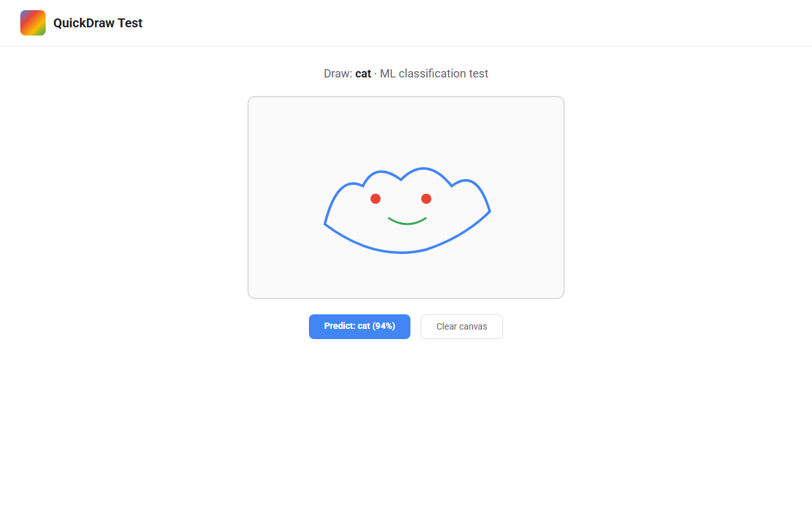

# 🚀 Quickdraw Test

**Quickdraw Test — professional open source project.**

Documented · MIT licensed · Maintained

---

## Screenshots

## 🐍 Contribution graph

<picture>
  <source media="(prefers-color-scheme: dark)" srcset="https://raw.githubusercontent.com/mafzalkalwardev/quickdraw-test/output/snake-dark.svg" />
  <source media="(prefers-color-scheme: light)" srcset="https://raw.githubusercontent.com/mafzalkalwardev/quickdraw-test/output/snake.svg" />
  
</picture>

---

First Pull Shark test
Second Pull Shark test
